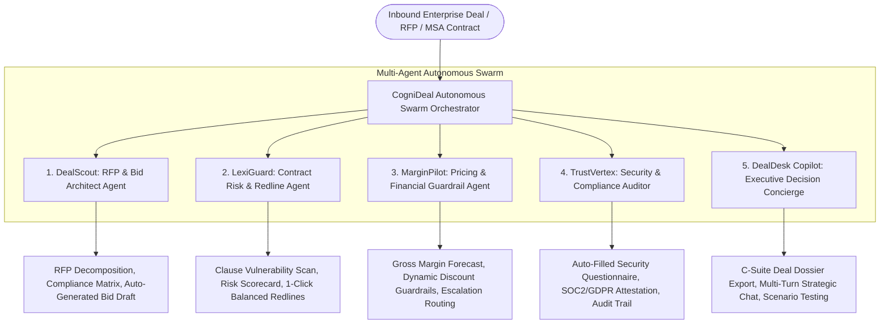

# CogniDeal AI — Autonomous B2B Deal Desk & Contract Risk Intelligence Swarm

[](https://bitsom.edu.in)
[](#)
[](#)
[](#)
[%202026-f43f5e.svg)](#-license--copyright)

> **BITSom Vertex Fest — Open-AI-Innovation Track**  
> *"The ultimate open canvas. If your disruptive B2B AI solution falls outside the specific domains above, pitch it here. Any real-world enterprise problem statement is eligible."*

---

## Executive Summary & Problem Statement

In modern B2B enterprise sales and procurement, closing high-value deals is plagued by **operational friction, hidden legal liabilities, and margin leakage**:

1. **RFP & Proposal Bottlenecks**: Bid teams spend **120+ hours per RFP** manually digesting complex 80-page procurement tenders and searching for technical answers across fragmented silos.
2. **Hidden Contract Liabilities & Legal Latency**: In-house legal counsels take **14–21 business days** to review Master Services Agreements (MSAs) and Statements of Work (SOWs). Critical liabilities—such as uncapped unilateral indemnification, punitive SLA penalties, and ambiguous IP transfer clauses—frequently slip past manual reviews.
3. **Margin Leakage & Rogue Discounting**: Sales teams grant unvetted volume discounts to hit quarterly quotas without real-time visibility into blended gross margin and working capital cash flow.
4. **Security & Regulatory Questionnaire Fatigue**: Vendor onboarding security reviews (SOC2, ISO 27001, GDPR, HIPAA, EU AI Act) stall enterprise deals for months over repetitive 200-question spreadsheets.
5. **Lack of Executive Deal Desk Cockpit**: C-Suite executives and General Counsels lack a real-time autonomous intelligence copilot that synthesizes deal health, legal exposures, and financial trade-offs.

---

## The Solution: **CogniDeal AI**

**CogniDeal AI** is an enterprise-grade Autonomous Multi-Agent Deal Desk and Contract Risk Swarm powered by **Google Gemini (Vertex AI)**. It coordinates **5 specialized autonomous AI agents** to compress enterprise deal cycles from **21 days to under 2 days**, eliminate catastrophic contractual liabilities, and preserve enterprise profit margins.

---

## 🏛️ Autonomous Swarm Architecture



---

## 🤖 The 5 Autonomous Enterprise Agents

| Agent | Codename | Core Autonomous Function | Primary Enterprise Deliverable |
| :--- | :--- | :--- | :--- |
| 📑 **DealScout** | RFP Architect | Ingests complex enterprise tenders & decomposes specifications. | Compliance matrix, competitive gap analysis, and tailored winning proposal draft. |
| ⚖️ **LexiGuard** | Contract Risk & Redline | Audits inbound MSAs, SOWs, and SLAs against General Counsel benchmarks. | Identifies predatory terms (uncapped indemnity, SLA penalties) and generates balanced substitute redlines. |
| 💰 **MarginPilot** | Pricing Guardrails | Models deal gross margins, ARR/TCV, and cash flow payment terms. | Prevents margin leakage with dynamic discount approval thresholds (Deal Desk vs. VP vs. CFO). |
| 🛡️ **TrustVertex** | Security Auditor | Verifies vendor security requirements against institutional control frameworks. | Instant citation-backed answers to vendor security questionnaires (SOC2, ISO 27001, GDPR, EU AI Act). |
| ⚡ **DealDesk Copilot** | Executive Concierge | Multi-turn conversational strategic copilot for C-Suite and General Counsels. | Real-time negotiation simulation, trade-off analysis, and 1-click clipboard executive dossier export. |

---

## 💼 Pre-Loaded Enterprise B2B Scenarios

CogniDeal AI includes 4 diverse, pre-computed enterprise deal scenarios:

1. **Fortune 500 Hybrid Cloud Migration & Autonomous FinOps** ($4.8M TCV, 3-Year Term)  
   *Counterparty*: ApexGlobal Financial Services  
   *Key Challenge*: Unlimited unilateral indemnification and 99.995% uptime liquidated damages penalties.
2. **Enterprise HealthTech Patient Intelligence Platform** ($2.4M TCV, 2-Year Term)  
   *Counterparty*: Vanguard Health Systems  
   *Key Challenge*: HIPAA Business Associate Agreement (BAA) liabilities and 24-hour breach notice window.
3. **Core Banking Microservices & Real-Time Settlement Engine** ($6.2M TCV, 4-Year Term)  
   *Counterparty*: Sovereign Capital Bank  
   *Key Challenge*: 4-hour source code escrow release triggers and 22% discount margin compression.
4. **Global Maritime & Fleet IoT Intelligence Swarm** ($3.1M TCV, 3-Year Term)  
   *Counterparty*: TransOceanic Freight Group  
   *Key Challenge*: Demurrage cargo spoilage consequential liabilities and maritime cyber regulations.

---

## ⚡ Dual Execution Modes

1. **Zero-Setup Offline Neural Simulation**:
   - Out of the box, all 4 enterprise deal scenarios feature complete pre-computed telemetry, interactive clause redline toggles, margin sensitivity sliders, and simulated neural analysis for custom inputs.
2. **Live Google Gemini Vertex AI Integration**:
   - Enter your Google Gemini API key in the top navigation modal.
   - Choose your preferred model tier:
     - `gemini-2.5-flash` (Ultra-Fast)
     - `gemini-1.5-pro` (Deep Legal & Financial Reasoning)
     - `gemini-1.5-flash` (Balanced Performance)
   - Enables live arbitrary contract clause risk scans and dynamic conversational Deal Desk Copilot advice.

---

## 🛠️ Technology Stack

- **Frontend**: React 18 + Vite + TypeScript
- **Styling**: Tailwind CSS v3 + Custom Obsidian Glassmorphic Design System
- **Icons**: `lucide-react`
- **Generative AI**: Google Gemini Vertex AI API (with offline neural fallback)
- **Architecture**: Multi-Agent Autonomous Swarm Pattern

---

## 🚀 Quickstart & Installation

### 1. Clone & Navigate
```bash
git clone https://github.com/ujju2020/Open-AI-Innovation.git
cd Open-AI-Innovation
```

### 2. Install Dependencies
```bash
npm install
```

### 3. Run Development Server
```bash
npm run dev
```
Open your browser at `http://localhost:3000` to interact with CogniDeal AI.

### 4. Build for Production
```bash
npm run build
```

### 5. Preview Production Bundle
```bash
npm run preview
```

---

## 📄 License & Copyright

**Copyright (c) 2026 Ujjwal Kumar Bhowmick**  
- **Developer**: Ujjwal Kumar Bhowmick  
- **Email**: [ujjwalkumarbhowmick30@gmail.com](mailto:ujjwalkumarbhowmick30@gmail.com)  
- **All rights reserved.**
