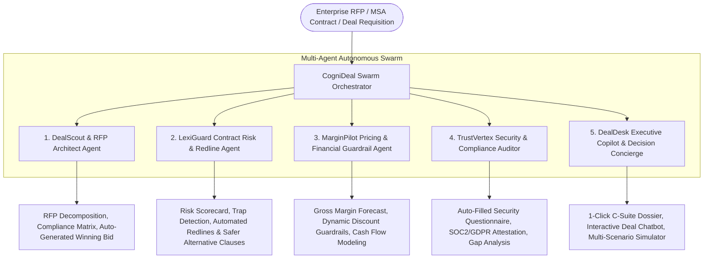

# Implementation Plan — CogniDeal AI (Autonomous B2B Deal Desk & Contract Risk Intelligence Swarm)

## Problem Statement & Context

From the [README.md](file:///c:/Users/Administration/Desktop/VibeCoding/BITSom%20Vertex%20Fest/Open-AI-Innovation/README.md):
> *"The ultimate open canvas. If your disruptive B2B AI solution falls outside the specific domains above, pitch it here. Any real-world enterprise problem statement is eligible."*

### Enterprise B2B Problem: The Multi-Million Dollar Deal Friction & Risk Chasm
In modern B2B enterprises, deal closing and procurement execution is fractured, slow, and full of hidden risks:
1. **RFP & Proposal Bottlenecks**: B2B enterprise sales and bid teams spend **120+ hours per RFP** manually analyzing complex 80-page procurement tenders and searching for technical answers across siloed knowledge bases.
2. **Hidden Contract Liabilities & Legal Latency**: Legal teams take **14–21 business days** to review Master Services Agreements (MSAs), Statements of Work (SOWs), and Service Level Agreements (SLAs). Critical liabilities (unlimited indemnification, ambiguous termination clauses, SLA breach penalties) frequently slip through.
3. **Margin Leakage & Rogue Discounting**: Sales reps offer unvetted discounts to close quarters, while finance teams lack real-time visibility into the gross margin and cash-flow impacts before contract signing.
4. **Security & Regulatory Questionnaire Fatigue**: Vendor security reviews (SOC2, ISO 27001, GDPR, HIPAA, EU AI Act) stall deals for months with repetitive 200-question spreadsheets.
5. **Lack of Executive Visibility**: Deal Desk and C-suite leaders lack a unified autonomous cockpit that synthesizes deal health, risk scorecards, and margin trade-offs in real time.

---

## The Proposed Flagship Solution: **CogniDeal AI**

**CogniDeal AI** is an enterprise-grade Autonomous Multi-Agent B2B Deal Desk & Contract Risk Intelligence Platform powered by **Google Gemini (Vertex AI)**. It orchestrates a swarm of 5 specialized agents that collaborate to accelerate deal velocity by 85%, eliminate high-risk contractual traps, and safeguard enterprise profit margins.

### Swarm Architecture & Workflow



### The 5 Autonomous Enterprise Agents
1. 📑 **DealScout & RFP Architect Agent**:
   - Ingests complex multi-page enterprise RFPs/RFQs.
   - Automatically parses technical, commercial, and delivery requirements into a structured compliance matrix.
   - Synthesizes tailored, competitive proposal drafts based on historical winning bids and product capabilities.
2. ⚖️ **LexiGuard Contract Risk & Redline Agent**:
   - Performs granular clause-by-clause legal risk assessment (Indemnity, Liability Caps, IP Assignment, Governing Law, Termination, SLAs).
   - Assigns a contract risk index (0–100) and flags high-risk predatory terms.
   - Provides instant 1-click redline replacements with battle-tested balanced clauses.
3. 💰 **MarginPilot Pricing & Financial Guardrail Agent**:
   - Real-time deal gross margin forecasting, ARR/TCV computation, and payment term risk evaluation.
   - Enforces tiered approval thresholds for volume discounts, preventing margin leakage while optimizing win-rate.
4. 🛡️ **TrustVertex Security & Compliance Auditor**:
   - Cross-references vendor security requirements against SOC2 Type II, ISO/IEC 27001, HIPAA, GDPR, and the EU AI Act.
   - Instant automated answering of vendor questionnaires with verified security control citations.
5. ⚡ **DealDesk Executive Copilot & Decision Concierge**:
   - Multi-turn conversational intelligence agent for C-Suite, VP of Sales, and General Counsel.
   - Delivers real-time deal viability summaries, trade-off simulations ("What if we raise the liability cap to 2x for a 3-year upfront commitment?"), and 1-click deal dossiers.

---

## User Review Required

> [!IMPORTANT]
> **Proposed Technical Stack**:
> - **Frontend**: React 18 + Vite + TypeScript.
> - **Styling**: Modern Vanilla CSS design system enhanced with utility classes (`#080C14` dark obsidian background, glassmorphic cards, luminous gradients, crisp typography with Google Fonts `Plus Jakarta Sans` & `JetBrains Mono`).
> - **Icons**: `lucide-react` for crisp enterprise iconography.
> - **Dual-Engine Execution**:
>   1. **Zero-Latency Interactive Simulation**: 4 comprehensive enterprise scenarios (Fortune 500 Cloud Migration, Healthcare SaaS Compliance, FinTech Core Banking API, Global Logistics IoT Swarm) with rich pre-computed telemetry and live interactive sandboxes.
>   2. **Live Google Gemini Vertex AI Integration**: Real-time contract analysis and interactive deal concierge chat using user-supplied Gemini API key with dynamic model selection (`gemini-2.5-flash`, `gemini-1.5-pro`, `gemini-1.5-flash`).

> [!NOTE]
> **License & Copyright Attribution**:
> The exact copyright block specified by the user will be added to the project's [README.md](file:///c:/Users/Administration/Desktop/VibeCoding/BITSom%20Vertex%20Fest/Open-AI-Innovation/README.md) and as header comments across all source files:
> ```markdown
> ## 📄 License & Copyright
> 
> **Copyright (c) 2026 Ujjwal Kumar Bhowmick**  
> - **Developer**: Ujjwal Kumar Bhowmick  
> - **Email**: [ujjwalkumarbhowmick30@gmail.com](mailto:ujjwalkumarbhowmick30@gmail.com)  
> - **All rights reserved.**
> ```

---

## Proposed Project File Structure

```
Open-AI-Innovation/
├── index.html                           # SEO meta tags, Google Fonts (Plus Jakarta Sans, JetBrains Mono)
├── package.json                         # React 18, Vite, TypeScript, Lucide-react
├── vite.config.ts                       # Vite configuration
├── tsconfig.json                        # TypeScript strict configuration
├── src/
│   ├── main.tsx                         # React application entry point
│   ├── App.tsx                          # Primary dashboard with header, hero telemetry, tabs & drawer
│   ├── index.css                        # Glassmorphism tokens, gradients, animations, modern responsive layout
│   ├── types/
│   │   └── deal.ts                      # TypeScript models for RFPs, Contracts, Clauses, Pricing, Security
│   ├── data/
│   │   └── enterprisePresets.ts         # 4 rich pre-computed enterprise B2B deal scenarios
│   ├── services/
│   │   └── geminiService.ts             # Google Gemini API client for live contract review & deal concierge
│   └── components/
│       ├── Header.tsx                   # Enterprise navigation, scenario switcher, swarm status, API key modal toggle
│       ├── TelemetryHero.tsx            # KPI strip (Deal Velocity, Avg Risk Index, Margin Protection, Auto-Redline Rate)
│       ├── SwarmPipelineVisualizer.tsx  # Live multi-agent execution pipeline with confidence & token telemetry
│       ├── ApiKeyModal.tsx              # Gemini API credentials modal with model switcher and connection test
│       └── tabs/
│           ├── DealScoutTab.tsx         # Interactive RFP parser, requirements matrix & automated proposal generator
│           ├── LexiGuardTab.tsx         # Contract risk scorecard, clause-by-clause auditor with 1-click redlining
│           ├── MarginPilotTab.tsx       # Pricing elasticity, discount guardrails & gross margin simulator
│           ├── TrustVertexTab.tsx       # Security questionnaire solver & compliance certification matrix
│           └── DealDeskCopilotTab.tsx   # Interactive conversational Deal Desk assistant with scenario testing
└── README.md                            # Comprehensive hackathon presentation, architecture, and copyright
```

---

## Verification Plan

### Automated Verification
1. `npm run build`: Full TypeScript type check (`tsc`) and Vite production bundle compilation to guarantee zero build or syntax errors.

### Interactive & Manual Verification
1. **Scenario Switching**: Verify seamless switching between all 4 enterprise B2B deal presets (Cloud Migration, Healthcare SaaS, FinTech Core, Global Logistics).
2. **Interactive Contract Redlining**: Test interactive acceptance and toggling of clause redlines in the LexiGuard tab with dynamic risk score updates.
3. **Interactive Margin Simulator**: Test slider-based discount adjustments and verify real-time recalculated margin health.
4. **Interactive Swarm Execution**: Trigger the simulated autonomous multi-agent swarm run and verify status progression.
5. **Interactive Copilot / Custom Input**: Test custom contract text analysis and prompt queries via offline simulation and live Gemini API test.
6. **Documentation Verification**: Confirm [README.md](file:///c:/Users/Administration/Desktop/VibeCoding/BITSom%20Vertex%20Fest/Open-AI-Innovation/README.md) has all updated sections, architecture diagrams, features, and the complete Copyright block.
